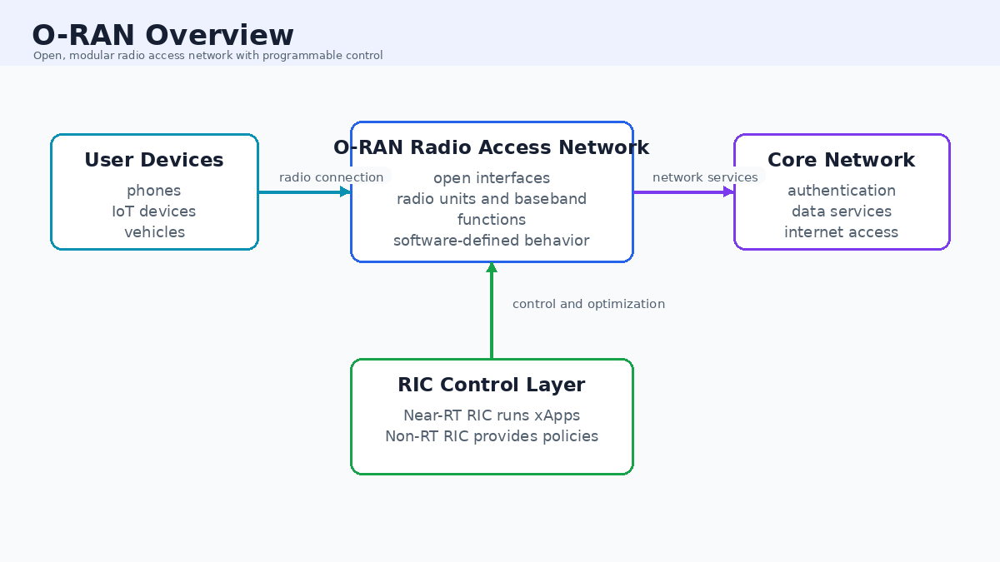
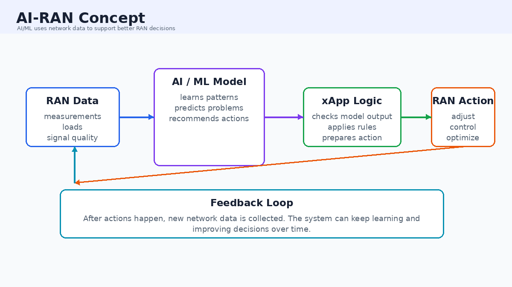
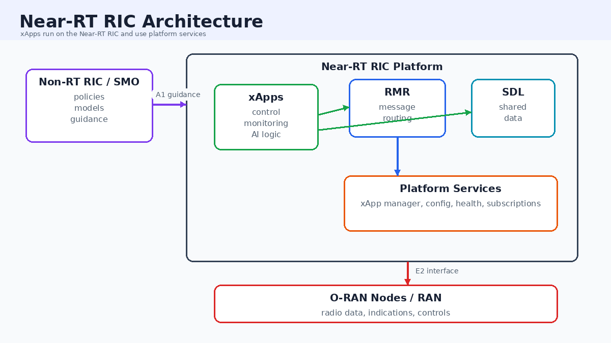
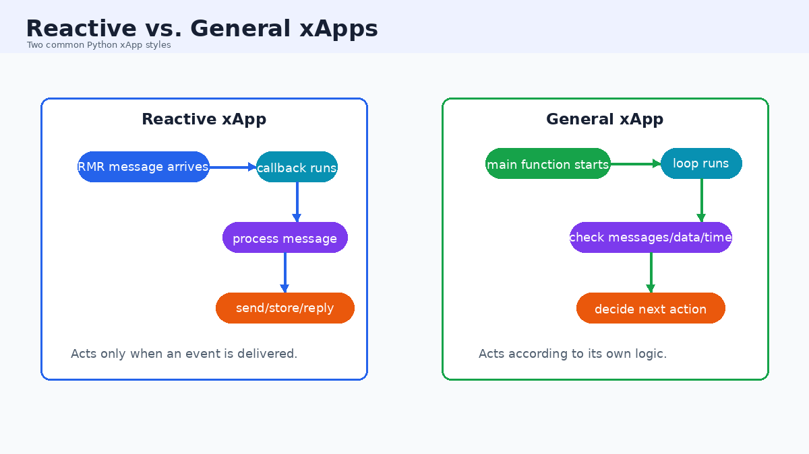
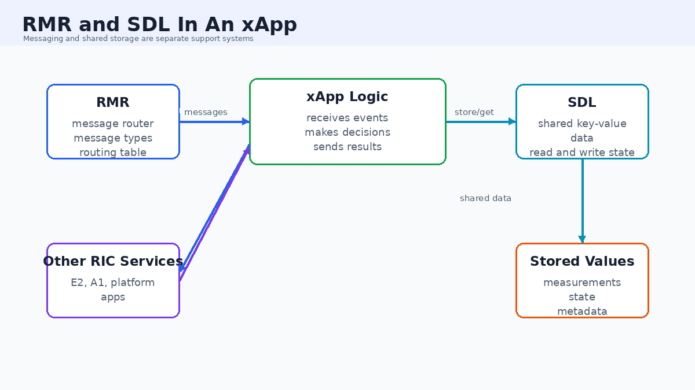
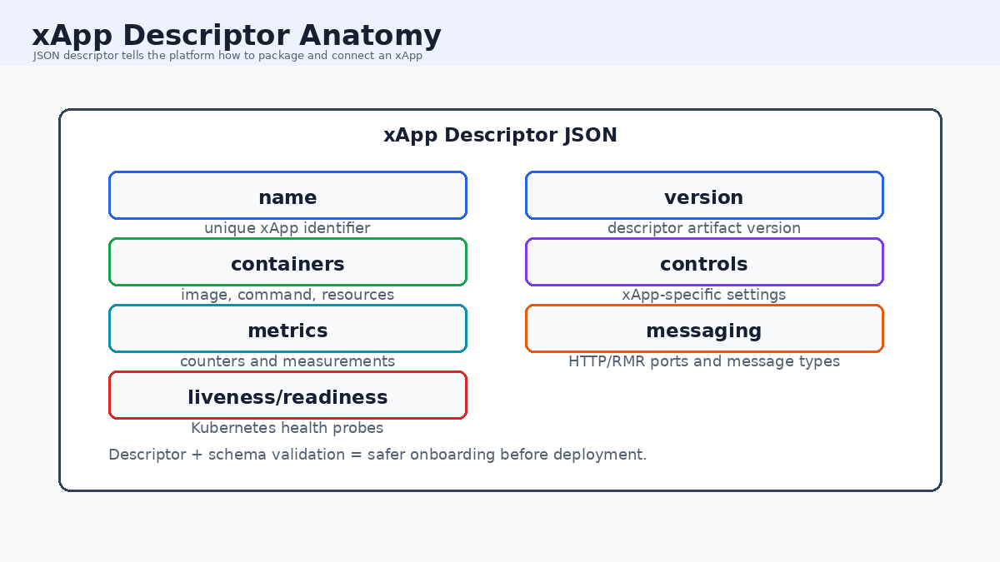
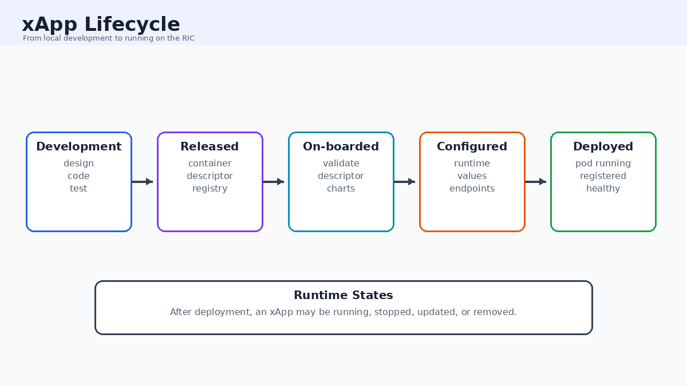
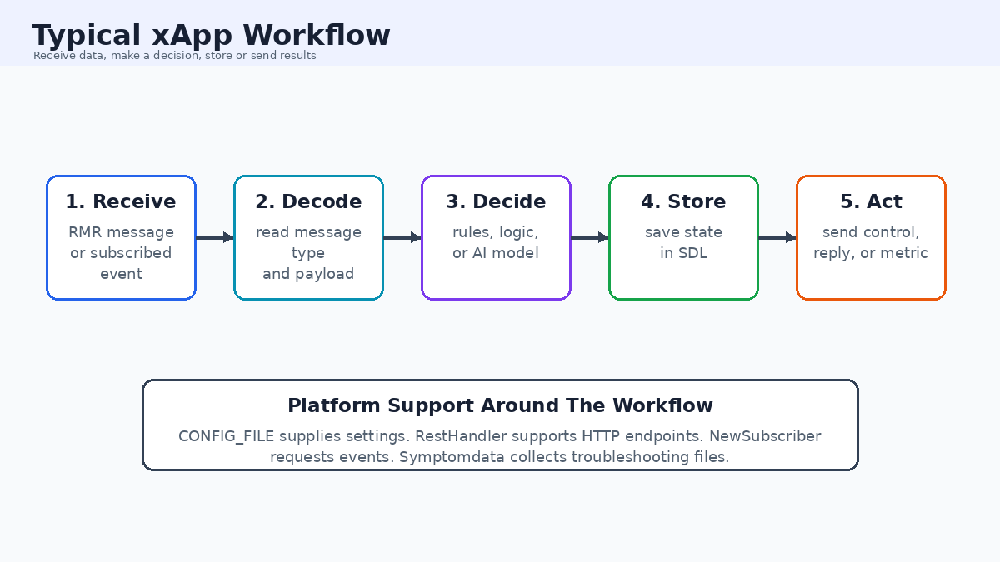

# xApp Basics Understanding

## Overview

This guide introduces xApps and the main platform concepts around them.

It covers:

- what an xApp is
- why xApps exist
- where xApps fit in O-RAN and AI-RAN
- what kinds of xApps exist
- what files and components usually make up an xApp
- what the Python xApp framework helps with

---

## 1. Big Picture: What Is O-RAN?

O-RAN stands for Open Radio Access Network.

A radio access network, or RAN, is the part of a mobile network that connects phones, devices, and radios to the rest of the network.

In a normal mobile network, many parts may come from one vendor and may be closed or hard to change.

O-RAN tries to make the RAN more:

- open
- programmable
- modular
- easier to monitor
- easier to improve with software

Simple idea:

> O-RAN makes the mobile network more like a programmable platform.



*Figure 1: O-RAN overview showing user devices, the open radio access network, the RIC control layer, and the core network.*

---

## 2. What Is AI-RAN?

AI-RAN means using artificial intelligence and machine learning inside the radio access network.

In simple terms:

> AI-RAN uses AI to help the network make better decisions.

Examples of decisions an AI-RAN system might help with:

- which users need more radio resources
- when a cell is overloaded
- whether a radio link is getting weak
- how to reduce interference
- how to improve energy efficiency
- how to detect unusual network behavior

AI-RAN does not mean the whole network becomes magic or fully automatic. It means software can use data, models, and rules to help manage the network better.



*Figure 2: AI-RAN concept showing how RAN data, AI/ML models, xApp logic, and network actions form a feedback loop.*

---

## 3. What Is A RIC?

RIC stands for RAN Intelligent Controller.

The RIC is a software platform that helps control and optimize the RAN.

There are two major RIC ideas:

| RIC Type | Time Scale | Simple Meaning |
|---|---|---|
| Non-RT RIC | slower, usually seconds or longer | long-term planning, policy, training, guidance |
| Near-RT RIC | faster, roughly near real-time | faster control and optimization close to the radio network |

xApps run on the Near-RT RIC.

Simple idea:

> The Near-RT RIC is where xApps run so they can react to radio network events quickly.

---

## 4. What Is An xApp?

An xApp is an application that runs on the Near-RT RIC.

The O-RAN writer guide describes an xApp logically as an entity that implements a well-defined function. Mechanically, it is deployed as a Kubernetes pod.

Simple version:

> An xApp is a small software app that watches, analyzes, or controls part of the radio network.

An xApp might:

- receive messages from the RAN
- analyze radio measurements
- send control messages
- store data
- read configuration
- report metrics
- react to policy guidance

---

## 5. Why xApps Are Useful

xApps are useful because they let engineers add new behavior to the RAN without rebuilding the whole network.

Examples:

| xApp Idea | What It Might Do |
|---|---|
| monitoring xApp | watches radio measurements |
| control xApp | sends control decisions |
| optimization xApp | improves performance |
| anomaly detection xApp | looks for unusual behavior |
| AI/ML xApp | uses a model to make predictions or decisions |

In an AI-RAN setting, an xApp can be one place where AI logic is used near the network.

Example:

> A model predicts that a user is about to have poor signal quality, and an xApp reacts by suggesting or sending a control action.

---

## 6. Where xApps Fit In The O-RAN System

A simplified O-RAN picture looks like this:

```text
Non-RT RIC / SMO
        |
        | policies, guidance, models
        v
Near-RT RIC
        |
        | xApps run here
        v
O-RAN radio network nodes
```

The xApp does not usually talk directly to every radio by itself. It uses RIC platform services and interfaces.

Important pieces around an xApp:

| Piece | Simple Meaning |
|---|---|
| Near-RT RIC | platform where xApps run |
| RMR | message routing system used by xApps |
| SDL | shared data storage |
| xApp Manager | helps deploy and manage xApps |
| E2 interface | connection toward radio network nodes |
| A1 policy | guidance from higher-level control |



*Figure 3: Near-RT RIC architecture showing xApps, RMR, SDL, platform services, and the connection toward O-RAN nodes.*

---

## 7. The Python xApp Framework

The Python xApp framework is called `xapp-frame-py`.

Its job is to reduce the amount of code an xApp developer has to write.

The official framework overview says the Python framework provides common features needed by Python xApps, including communication with:

- RMR, the RIC Message Router
- SDL, the Shared Data Layer

Simple idea:

> The framework handles common xApp plumbing so the programmer can focus more on the xApp's logic.

Without a framework, the developer would need to write more setup code for messaging, storage, health checks, and platform connection.

---

## 8. Two Main Types Of Python xApps

The Python framework overview describes two major xApp styles:

1. reactive xApps
2. general xApps

These are different ways an xApp can decide when to do work.

---

## 9. Reactive xApps

A reactive xApp acts only when a message arrives.

Simple idea:

> A reactive xApp waits for an event, then runs code in response.

Example:

```text
RMR message arrives
        |
        v
framework checks message type
        |
        v
matching callback function runs
```

This is similar to:

> When this event happens, run this function.

Reactive xApps use callback functions.

A callback is a function that is saved and called later when something happens.

For a reactive xApp:

- each expected message type can have its own callback
- a default callback handles messages that do not match a specific callback
- the framework receives messages and calls the correct function

---

## 10. General xApps

A general xApp acts according to its own logic.

It may still receive RMR messages, but it is not only message-triggered.

Simple idea:

> A general xApp has its own main loop or main function.

Example:

```text
start xApp
        |
        v
run main function
        |
        v
check data, check messages, make decisions
        |
        v
repeat until stopped
```

A general xApp might:

- periodically check data
- read from SDL
- read messages from RMR
- run a model
- make decisions on a schedule

The framework sets up RMR and SDL, then calls the xApp's main function.

---

## 11. Reactive vs General xApps

| Feature | Reactive xApp | General xApp |
|---|---|---|
| Main trigger | incoming RMR message | xApp's own logic |
| Common structure | callbacks by message type | main function or loop |
| Good for | event-driven behavior | scheduled or mixed behavior |
| Framework role | receives messages and invokes callbacks | sets up services, then runs client function |

Easy analogy:

| Type | Analogy |
|---|---|
| Reactive xApp | a doorbell: it reacts when someone rings |
| General xApp | a security guard: it keeps checking things on its own |



*Figure 4: Comparison of reactive xApps and general xApps based on their trigger and execution style.*

---

## 12. What Is RMR?

RMR stands for RIC Message Router.

RMR is how xApps send and receive many RIC messages.

Simple idea:

> RMR is the message delivery system used inside the RIC platform.

Messages are routed based on information such as:

- message type
- subscription ID
- routing table

The writer guide explains that RMR helps applications send messages to other RMR-based applications and manages the network connections for them.

Simple explanation:

> Instead of every xApp manually figuring out where every other service lives, RMR helps route messages.

---

## 13. RMR Message Types

An RMR message has a type.

The message type tells the xApp what kind of message it is.

Examples from the writer guide include message names like:

- `RIC_SUB_REQ`
- `RIC_SUB_RESP`
- `RIC_SUB_FAILURE`
- `RIC_INDICATION`

Simple idea:

> A message type is like a label on a package. It tells the receiver how to handle it.

In a reactive xApp, message type often decides which callback function runs.

---

## 14. RMR Ports

The writer guide shows common RMR ports:

| Port | Common Use |
|---|---|
| `4560` | RMR data |
| `4561` | RMR route |

RMR data is for the actual messages.

RMR route is for routing information.

Simple idea:

> One port carries messages, and another helps with routing setup.

---

## 15. What Is SDL?

SDL stands for Shared Data Layer.

SDL is a shared key-value storage system.

Simple idea:

> SDL is a place where xApps and RIC services can store and read shared information.

Key-value storage means data is stored like:

```text
key -> value
```

Example:

```text
"last_cell_load" -> 72
```

An xApp might use SDL to:

- store recent measurements
- read information about radio nodes
- save temporary state
- share information with other services

The Python framework provides an `SDLWrapper` so Python code can use SDL more easily.



*Figure 5: RMR and SDL architecture showing how xApp logic uses message routing and shared data storage.*

---

## 16. What Is A Config File?

An xApp needs configuration.

Configuration tells the xApp how it should behave in a specific environment.

Examples of configuration:

- xApp name
- xApp version
- which ports it uses
- which messages it sends or receives
- control parameters
- metrics information

In the local Python framework code, the framework checks an environment variable named:

```text
CONFIG_FILE
```

That variable points to the xApp's config file path.

Simple idea:

> `CONFIG_FILE` tells the xApp where to find its settings.

The framework can also watch the config file for changes.

---

## 17. xApp Descriptor

The xApp descriptor is a JSON file that describes the xApp.

The writer guide says the descriptor gives the RIC platform the basic and essential information it needs to manage the xApp lifecycle.

Simple idea:

> The descriptor is the xApp's ID card and setup plan.

It tells the platform:

- what the xApp is called
- what version it is
- what container image it uses
- what ports it needs
- what messages it sends and receives
- what configuration values it needs
- what metrics it reports

---

## 18. Main Descriptor Sections

Common descriptor sections include:

| Section | Required? | Simple Meaning |
|---|---|---|
| `name` | required | unique xApp name |
| `version` | required | xApp descriptor version |
| `containers` | required | container image and startup details |
| `controls` | optional | xApp-specific settings |
| `metrics` | optional | measurements the xApp reports |
| `messaging` | optional | ports and message types |
| `livenessProbe` | optional | how Kubernetes checks if app is alive |
| `readinessProbe` | optional | how Kubernetes checks if app is ready |

---

## 19. `name` And `version`

The `name` is the xApp's unique identifier.

Example:

```json
"name": "example_xapp"
```

The `version` is the version of the xApp descriptor.

Example:

```json
"version": "1.0.0"
```

Together, these help the platform know exactly which xApp artifact is being deployed.

---

## 20. `containers`

The `containers` section describes the container image used to run the xApp.

An xApp is packaged as a Docker container and deployed as a Kubernetes pod.

The container section can include:

- container name
- image registry
- image name
- image tag
- command
- arguments
- resource limits and requests

Simple idea:

> The container section tells Kubernetes what software image to start.

---

## 21. `controls`

The `controls` section holds xApp-specific settings.

This section is optional because different xApps need different settings.

Example settings might include:

- whether the xApp starts active
- requestor ID
- RAN function ID
- action ID
- interface information

Simple idea:

> `controls` are settings the xApp itself understands.

If an xApp uses a `controls` section, the developer should also provide a schema that describes the expected structure.

---

## 22. JSON Schema

A JSON schema describes what a JSON file is allowed to contain.

Simple idea:

> A schema is a rulebook for a JSON file.

If the descriptor says a value should be a number, but the file gives a word, schema validation can catch the mistake.

The writer guide explains that the xApp onboarding process validates the xApp descriptor against a schema.

This helps avoid deploying badly described xApps.

### What A Typical xApp Descriptor Looks Like

An xApp descriptor is usually the JSON file that describes the xApp to the RIC platform.

Important idea:

> The descriptor says what the xApp is, what container runs it, what settings it needs, and how it communicates.

The real descriptor can be long. The shortened structure below only shows the important parts.

This example uses `jsonc` so comments can explain the nested structure. Real JSON files do not allow comments.

```jsonc
{
  // Required: unique xApp name.
  // The platform uses this to identify the xApp.
  "name": "example_xapp",

  // Required: descriptor version.
  // This is usually a semantic version such as 1.0.0.
  "version": "1.0.0",

  // Required: container information.
  // This tells Kubernetes what image to run.
  "containers": [
    {
      // Name of the container inside the xApp pod.
      "name": "example-container",

      // Docker image information.
      // registry: where the image is stored
      // name: image name
      // tag: version tag
      "image": {
        "registry": "example-registry",
        "name": "example-xapp-image",
        "tag": "latest"
      },

      // Optional: command and args used when the container starts.
      "command": ["python3"],
      "args": ["main.py"]
    }
  ],

  // Optional: xApp-specific settings.
  // These are settings the xApp code understands.
  "controls": {
    "active": true,
    "requestorId": 66,
    "ranFunctionId": 1
  },

  // Optional: metrics the xApp reports.
  // Metrics help operators monitor what the xApp is doing.
  "metrics": [
    {
      "objectName": "ExampleCounters",
      "objectInstance": "ExampleInstance",
      "name": "ExampleMessageCount",
      "type": "counter",
      "description": "Number of example messages processed"
    }
  ],

  // Optional: communication settings.
  // This describes HTTP and RMR ports, plus message types.
  "messaging": {
    "ports": [
      {
        // HTTP port for REST endpoints such as config or health.
        "name": "http",
        "container": "example-container",
        "port": 8080,
        "description": "HTTP service"
      },
      {
        // RMR data port.
        // rxMessages are messages this xApp expects to receive.
        // txMessages are messages this xApp may send.
        "name": "rmrdata",
        "container": "example-container",
        "port": 4560,
        "rxMessages": ["RIC_INDICATION"],
        "txMessages": ["RIC_SUB_REQ"],
        "policies": [],
        "description": "RMR data port"
      },
      {
        // RMR route port.
        // This helps with RMR routing information.
        "name": "rmrroute",
        "container": "example-container",
        "port": 4561,
        "description": "RMR route port"
      }
    ]
  }
}
```

Summary:

| Descriptor Part | What It Tells The Platform |
|---|---|
| `name` | what the xApp is called |
| `version` | which version this descriptor describes |
| `containers` | what container image runs the xApp |
| `controls` | settings used by the xApp's own code |
| `metrics` | counters or measurements the xApp exposes |
| `messaging` | ports and message types used by the xApp |

### What A Typical xApp Schema Looks Like

A schema is different from a descriptor.

The descriptor says:

> Here is my xApp configuration.

The schema says:

> Here are the rules that the configuration must follow.

The schema can define:

- which fields are required
- what type each field should be
- whether strings must match a pattern
- whether numbers must be within a range
- whether extra fields are allowed

Here is a shortened schema-style example.

This is not a full production schema. It highlights the important ideas.

```jsonc
{
  // The schema format version.
  // draft-07 is commonly used in the writer guide.
  "$schema": "http://json-schema.org/draft-07/schema#",

  // This schema describes a JSON object.
  "type": "object",

  // Required top-level fields.
  // If one of these is missing, validation should fail.
  "required": ["name", "version", "containers"],

  // Rules for each top-level property.
  "properties": {
    "name": {
      "type": "string",

      // Pattern means the string must match a rule.
      // This type of pattern is a regular expression.
      //
      // Beginner meaning:
      // only allow certain characters in the xApp name.
      //
      // Example idea:
      // allow letters, numbers, underscores, dots, and dashes.
      "pattern": "^[A-Za-z0-9_.-]+$"
    },

    "version": {
      "type": "string",

      // This regular expression checks for a version like:
      // 1.0.0
      // 2.3.4
      //
      // ^ means start of string.
      // [0-9]+ means one or more digits.
      // \\. means a real period character.
      // $ means end of string.
      "pattern": "^[0-9]+\\.[0-9]+\\.[0-9]+$"
    },

    "containers": {
      "type": "array",

      // minItems means the array must contain at least this many items.
      "minItems": 1,

      // items describes what each item in the array should look like.
      "items": {
        "type": "object",
        "required": ["name", "image"],
        "properties": {
          "name": {
            "type": "string"
          },
          "image": {
            "type": "object",
            "required": ["registry", "name", "tag"],
            "properties": {
              "registry": { "type": "string" },
              "name": { "type": "string" },
              "tag": { "type": "string" }
            }
          }
        }
      }
    },

    "controls": {
      // Controls are xApp-specific.
      // Different xApps may have different control rules.
      "type": "object",
      "properties": {
        "active": {
          "type": "boolean"
        },
        "requestorId": {
          "type": "integer"
        },
        "ranFunctionId": {
          "type": "integer"
        }
      }
    },

    "messaging": {
      // Messaging is nested because each xApp may expose multiple ports.
      "type": "object",
      "properties": {
        "ports": {
          "type": "array",
          "items": {
            "type": "object",
            "required": ["name", "container", "port"],
            "properties": {
              "name": { "type": "string" },
              "container": { "type": "string" },

              // Port should be a number.
              // Real schemas may add minimum and maximum values.
              "port": { "type": "integer" },

              // rxMessages and txMessages are arrays of strings.
              "rxMessages": {
                "type": "array",
                "items": { "type": "string" }
              },
              "txMessages": {
                "type": "array",
                "items": { "type": "string" }
              }
            }
          }
        }
      }
    }
  }
}
```

### Why Schema Regex Can Look Confusing

Some schema fields use `pattern`.

`pattern` uses a regular expression, often called regex.

A regex is a compact rule for matching text.

Example:

```json
"pattern": "^[A-Za-z0-9_.-]+$"
```

Beginner explanation:

| Regex Part | Simple Meaning |
|---|---|
| `^` | start checking at the beginning |
| `[A-Za-z0-9_.-]` | allow letters, numbers, underscore, dot, dash |
| `+` | allow one or more of those characters |
| `$` | stop checking at the end |

So this pattern means:

> The whole string must be made from allowed name characters.

Regex does not need to be memorized at first. The key idea is that regex is used to enforce text rules.



*Figure 6: Anatomy of an xApp descriptor showing identity, container, control, metric, messaging, and health-check sections.*

---

## 23. `messaging`

The `messaging` section describes communication ports and message types.

It can define:

- HTTP ports
- RMR data ports
- RMR route ports
- TX messages, meaning messages the xApp can send
- RX messages, meaning messages the xApp can receive
- A1 policy information

Simple idea:

> The messaging section tells the platform how this xApp communicates.

Example ideas:

| Item | Meaning |
|---|---|
| `txMessages` | messages the xApp sends |
| `rxMessages` | messages the xApp receives |
| `port` | network port used by the container |
| `container` | which container the port belongs to |

---

## 24. Health Checks

Health checks help the platform know whether an xApp is working.

Two common Kubernetes health ideas:

| Check | Meaning |
|---|---|
| liveness | is the app alive? |
| readiness | is the app ready to receive traffic? |

The writer guide shows that xApps can define liveness and readiness probes.

These checks may be:

- HTTP-based
- RMR-based

Simple idea:

> Health checks are the platform's way of asking, "Are you alive and ready?"

---

## 25. xApp Lifecycle

The writer guide describes several lifecycle stages.

Simple version:

| Stage | Meaning |
|---|---|
| Development | design, code, and local testing |
| Released | code and descriptor are published |
| On-boarded / Distributed | descriptor and deployment package are prepared for a RIC environment |
| Runtime configuration | environment-specific settings are provided |
| Deployed | xApp pod is running on the RIC |

After deployment, some xApps may have states such as:

- running
- stopped



*Figure 7: xApp lifecycle from development through release, onboarding, runtime configuration, and deployment.*

---

## 26. Registration With The Platform

After deployment, an xApp may need to register with the RIC platform.

Registration tells the xApp Manager:

- app name
- app version
- app instance name
- HTTP endpoint
- RMR endpoint
- config path or config data

Simple idea:

> Registration tells the platform, "I am here, this is who I am, and this is how to reach me."

The local Python framework code contains registration logic that reads the xApp config and sends registration information to platform services.

---

## 27. How The Python Framework Starts Up

The local `ricxappframe` Python module shows a typical framework startup path.

Simplified startup:

```text
create xApp object
        |
        v
initialize RMR
        |
        v
start RMR receive thread
        |
        v
create SDL wrapper
        |
        v
read CONFIG_FILE if present
        |
        v
register xApp with platform
        |
        v
run xApp logic
```

The important idea is:

> The framework sets up the communication and storage tools before the xApp logic runs.

---

## 28. RMR Thread And Queue

The Python framework starts an RMR loop in a thread.

A thread is a separate flow of work inside a program.

The framework uses this so RMR messages can be read even if the xApp's own code is busy.

The local code places received RMR messages into a queue.

Simple idea:

> The framework keeps checking the mailbox and puts messages in a line for the xApp to process.

Why this matters:

- RMR is not a permanent message bus
- messages can be lost if they are not read quickly enough
- a separate RMR reading thread helps avoid missed messages

---

## 29. Important Python Framework Classes

The official user guide describes these public classes:

| Class | Simple Meaning |
|---|---|
| `_BaseXapp` | common base behavior shared by xApp classes |
| `RMRXapp` | used for reactive xApps |
| `Xapp` | used for general xApps |
| `SDLWrapper` | helper for shared data layer storage |
| `Symptomdata` | helper for collecting troubleshooting data |
| `RestHandler` | helper for REST-style HTTP handlers |
| `NewSubscriber` | helper for subscription operations |

Not every xApp uses all of these classes.

For basic understanding:

- `RMRXapp` is for event/message-driven xApps
- `Xapp` is for general xApps with their own logic
- `SDLWrapper` helps read and write shared data
- `RestHandler` helps the xApp answer HTTP requests
- `NewSubscriber` helps the xApp ask for RAN event subscriptions
- `Symptomdata` helps collect files or logs when troubleshooting is needed

---

## 30. Where These Helper Classes Fit

Not every xApp uses every helper class.

Think of these classes as optional tools in the xApp toolbox.

| Helper | Where It Fits In An xApp |
|---|---|
| `RestHandler` | the xApp's small HTTP server side |
| `NewSubscriber` | the xApp's subscription request side |
| `Symptomdata` | the xApp's troubleshooting and support data side |

### `RestHandler`

`RestHandler` helps an xApp respond to HTTP requests.

HTTP is the same general request/response style used by web browsers and web APIs.

In an xApp, REST-style HTTP endpoints may be used for things like:

- returning config
- answering health checks
- receiving subscription responses
- serving symptom data

The local framework code shows examples of handler paths such as:

```text
/ric/v1/config
/ric/v1/health/alive
/ric/v1/health/ready
/ric/v1/symptomdata
```

Simple idea:

> `RestHandler` helps the xApp answer web-style requests from other platform components.

### `NewSubscriber`

`NewSubscriber` helps an xApp work with the RIC subscription manager.

A subscription means:

> Please send me certain events or measurements when they happen.

In the RAN context, an xApp may need to subscribe to receive E2-related events or indications.

The local `NewSubscriber` class includes methods for:

- creating subscription parameter objects
- sending a subscribe request
- sending an unsubscribe request
- querying current subscriptions
- starting a response handler for subscription responses

Simple idea:

> `NewSubscriber` helps an xApp ask the RIC platform for the radio events it wants to receive.

### `Symptomdata`

`Symptomdata` helps collect troubleshooting data.

When a system has a problem, engineers often need logs, files, and snapshots to understand what happened.

The local `Symptomdata` class can:

- subscribe for symptom data collection
- find files that match patterns
- collect files into a zip package
- read the collected data
- support a symptom data REST response

Simple idea:

> `Symptomdata` helps package useful debug information when something needs to be investigated.

### How The Helpers Work Together

A more complete xApp might use several helpers:

```text
xApp logic
   |
   |-- RMRXapp or Xapp: main xApp behavior
   |-- SDLWrapper: shared storage
   |-- RestHandler: HTTP config, health, or callback endpoints
   |-- NewSubscriber: request RAN event subscriptions
   |-- Symptomdata: collect troubleshooting files
```

For a first xApp, it is enough to understand the purpose of each helper before worrying about all implementation details.

---

## 31. Common RMR Methods In The Python Framework

The local Python framework includes methods such as:

| Method | Simple Meaning |
|---|---|
| `rmr_get_messages()` | read waiting messages from the queue |
| `rmr_send(...)` | send an RMR message |
| `rmr_rts(...)` | return a message to the sender |
| `rmr_free(...)` | free an RMR message buffer after use |

Important idea:

> RMR messages use memory buffers, so some low-level cleanup matters.

The practical takeaway is:

> The framework hides much of the hard messaging setup, but message handling still needs care.

---

## 32. Common SDL Methods

The SDL wrapper gives methods for working with shared data.

Examples:

| Method | Simple Meaning |
|---|---|
| `set(...)` | store a value |
| `get(...)` | read a value |
| `find_keys(...)` | search for keys |
| `delete(...)` | remove a value |

Simple idea:

> SDL is like a shared notebook where xApps can save and read named values.

---

## 33. A Simple xApp Mental Model

Think of an xApp like a robot team member.

It needs:

| Need | xApp Component |
|---|---|
| a name badge | descriptor `name` and `version` |
| a body to run in | Docker container |
| instructions | config / controls |
| a mailbox | RMR |
| a shared notebook | SDL |
| a web-style front desk | RestHandler |
| a way to request events | NewSubscriber |
| a debug package tool | Symptomdata |
| a health check | liveness/readiness probes |
| a job | xApp logic |

This analogy is not perfect, but it helps keep the parts organized.

---

## 34. Example xApp Story

Imagine an xApp that watches for network overload.

1. The RAN sends measurement messages.
2. RMR routes those messages to the xApp.
3. The xApp reads the message.
4. The xApp checks whether the cell looks overloaded.
5. The xApp stores recent values in SDL.
6. The xApp may use `NewSubscriber` to request the events it wants.
7. The xApp may answer health or config requests through `RestHandler`.
8. If troubleshooting is needed, `Symptomdata` can help collect files.
9. The xApp may send a control or policy-related message.
10. The platform checks that the xApp is alive and ready.

This is the same general pattern many xApps follow:

```text
receive data -> think -> store or act -> report health
```



*Figure 8: Typical xApp workflow showing message reception, decoding, decision logic, SDL storage, and platform action.*

---

## 35. xApps And AI

An AI-focused xApp may use a model.

The model might:

- classify a network state
- predict congestion
- detect abnormal behavior
- recommend an action

The xApp is not just the model.

The xApp also needs:

- messaging
- configuration
- storage
- deployment packaging
- health checks
- integration with the RIC platform

Simple idea:

> In AI-RAN, the model may be the brain, but the xApp is the full software package that lets the model work inside the RAN.

---

## 36. Important Vocabulary

| Term | Simple Meaning |
|---|---|
| O-RAN | open, programmable radio access network |
| AI-RAN | using AI/ML to help manage the RAN |
| RIC | RAN Intelligent Controller |
| Near-RT RIC | RIC where xApps run |
| xApp | application that runs on Near-RT RIC |
| RMR | message router used by xApps |
| SDL | shared data storage |
| descriptor | JSON file that describes the xApp |
| schema | rulebook for JSON structure |
| callback | function called when an event happens |
| reactive xApp | acts when a message arrives |
| general xApp | runs its own logic or loop |
| RestHandler | helper for HTTP-style xApp endpoints |
| NewSubscriber | helper for subscription requests |
| Symptomdata | helper for troubleshooting data collection |
| container | packaged app environment |
| Kubernetes pod | deployment unit where the xApp runs |
| liveness probe | checks if app is alive |
| readiness probe | checks if app is ready |

---

## 37. Notes For A Future Hands-On Section

Hands-on steps are not included yet.

When hands-on work is added later, command instructions should be very explicit, for example:

- open a terminal
- create a folder
- create a file
- leave this terminal running
- open a second terminal
- run a command in the second terminal
- stop the running program with `Ctrl+C`

This matters because xApp demos often involve more than one running process.

---

## Sources Used

- Local file: `xapp/Framework-Overview-xapp-frame-py-masterdocumentation.md`
- Local file: `xapp/xApp_Writer_s_Guide_v2.md`
- Local module: `xapp/ricxappframe/ricxappframe/xapp_frame.py`
- Local module: `xapp/ricxappframe/ricxappframe/xapp_rmr.py`
- Official O-RAN SC xApp Python Framework documentation: https://docs.o-ran-sc.org/projects/o-ran-sc-ric-plt-xapp-frame-py/en/latest/index.html
