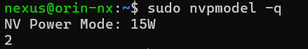
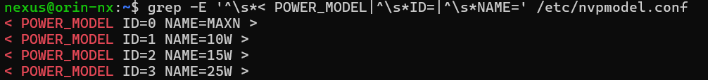

# Hiwonder ROSOrin Pro 2 Jetson Orin NX Super Setup

## OS Flashing tutorial

Follow the tutorial for installing and flashing you Jetson Board if using a fresh SSD:
- [Tutorial](https://www.yahboom.net/public/upload/upload-html/1747054476/Write%20Jetson%20original%20system.html#write-jetson-original-system)
- [Youtube Video](https://youtu.be/Ucg5Zqm9ZMk)

## Checking POWER Modes

Check Current power profile
```sh
sudo nvpmodel -q
```


Check all available modes
```sh
grep -E '^\s*< POWER_MODEL|^\s*ID=|^\s*NAME=' /etc/nvpmodel.conf
```



Switch modes
```
# sudo nvpmodel -m <ID>
sudo nvpmodel -m 0 # Will set to max mode MAXN (~40W)
```